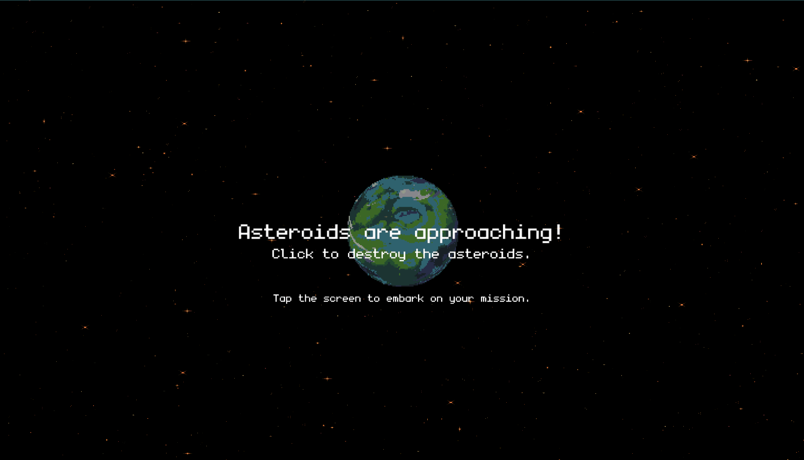
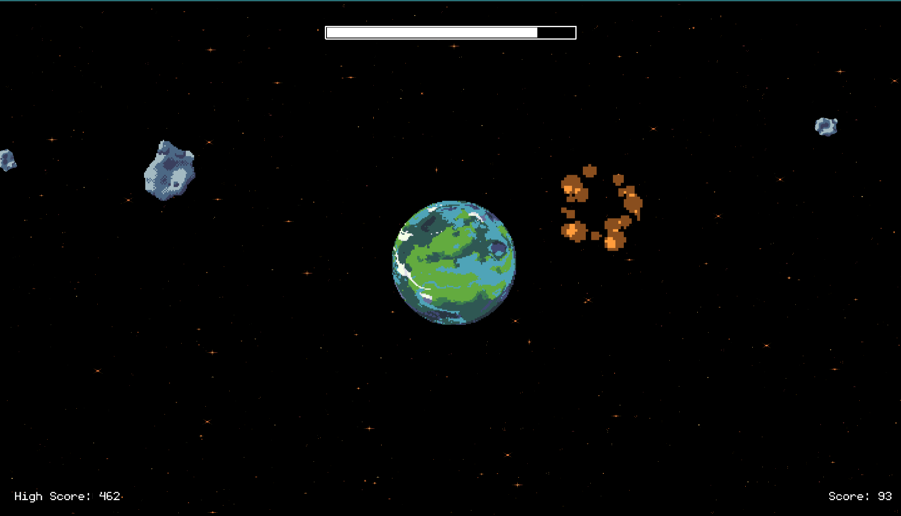
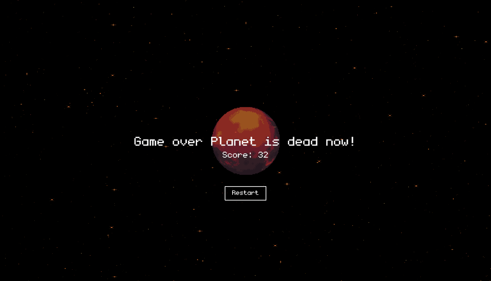

# 🌍 Meteorite

**Meteorite** is a 2D pixel art game built using [Kaboom.js](https://kaboomjs.com/) and TypeScript. In this game, you are the guardian of a habitable planet, defending it from an onslaught of meteoroids. The goal is to achieve the highest score by destroying meteoroids before they impact the planet.

## 🚀 Gameplay

- **Objective:** Protect the planet at the center of the screen by clicking on incoming meteoroids to destroy them.
- **Planet Health:** The planet has a health bar. If the health reaches zero, the planet becomes a dry, barren world like Mars, and the game ends.
- **Meteoroids:** 
  - Larger meteoroids deal more damage but grant fewer points.
  - Smaller meteoroids deal less damage but grant more points.
- **Scoring:** Aim to achieve the highest score possible by efficiently destroying meteoroids.
- **High Score:** The game saves the highest score, challenging players to beat their previous records.

## 🎮 Controls

- **Click:** Destroy meteoroids by clicking on them.

## 🖼️ Screenshots





## 🛠️ Technologies Used

- **Kaboom.js** - A JavaScript game programming library.
- **TypeScript** - For added type safety and better development experience.
- **HTML/CSS** - For rendering the game and styling.

## 📦 Installation

1. Clone the repository:
   ```bash
   git clone https://github.com/kerimcanbalkan/save-the-planet.git
   ```
2. Navigate to the project directory:
   ```bash
   cd save-the-planet
   ```
3. Install dependencies:
   ```bash
   npm install
   ```
4. Run the game:
   ```bash
   npm run dev
   ```
